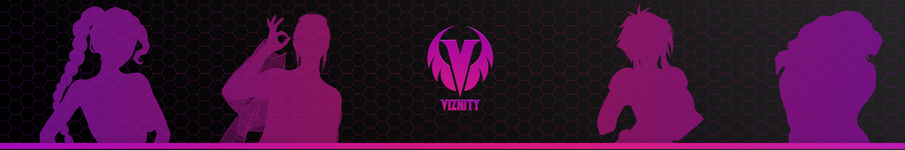

<!-- PROJECT LOGO -->
 

  

  <h3 align="center">Viznity Games</h3>

  

    NSFW Game Developer
     
	 
	<a href="https://patreon.com/Viznity">💜 Support the Developer</a>
    ·
    <a href="https://www.patreon.com/posts/feedback-section-36185082">🟡 Report Bug</a>
  

- 🌌 Hi, I’m @Viznity
- 💻 I’m currently developing +18 games
- 💞️ I’m looking to collaborate on NSFW artists
- 📧 Contact: viznity@gmail.com

<!---
Viznity/Viznity is a ✨ special ✨ repository because its `README.md` (this file) appears on your GitHub profile.
You can click the Preview link to take a look at your changes.
--->
